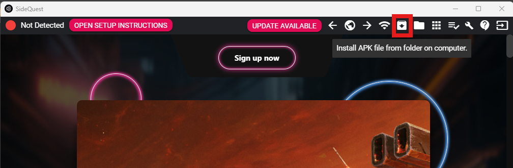
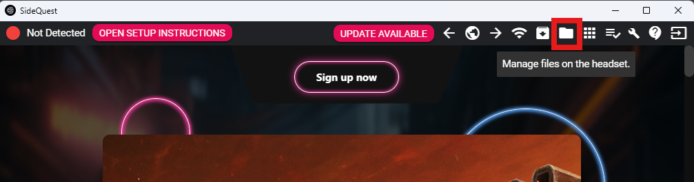

[Home](../README.md)
# SideQuest Quickstart
For a lot of tasks on the Quest it can be helpful to access low level files or ADB commands. SideQuest is a free tool that allows you to do this with a simple GUI interface. To get started, download SideQuest from [SideQuestVR](https://sidequestvr.com/#/download) and install the **Desktop App** it on your computer. Sidequest includes ADB video streaming but we also have a [streaming script](https://github.com/leggedrobotics/quest-streaming).

## Connecting the Quest
To connect the Quest to SideQuest, first enable developer mode on the Quest by following the instructions in the [Meta Quest Quickstart](./quest.md) guide. Then connect the Quest to your computer via USB. You may need to accept a prompt on the Quest to allow USB debugging. Once connected, open SideQuest and you should see a green dot in the top left corner indicating that the Quest is connected.

## Sideloading the App

To sideload the app onto the Quest, first build the APK from Unity by going to `File -> Build Settings` and clicking the `Build` button. Save the APK to a location on your computer. Once the APK is built, open SideQuest and click the `Install APK file from folder on computer` button in the upper right corner. Navigate to the location where you saved the APK and select it. SideQuest will then install the APK onto the Quest. Once installed, you can launch the app from the Quest menu under `Unknown Sources`.

## Downloading Images and Files

To download images and files from the Quest, open SideQuest and click the `Manage files on the headset` button in the top menu. This will open a new window where you can navigate the file system of the Quest. You can then navigate to the desired folder and click the `Download folder to computer` button to download the entire folder to your computer. You can also select individual files and click the `Download selected files` button to download specific files.
